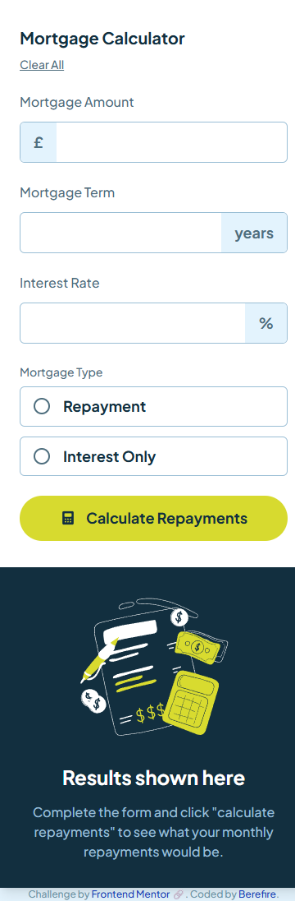
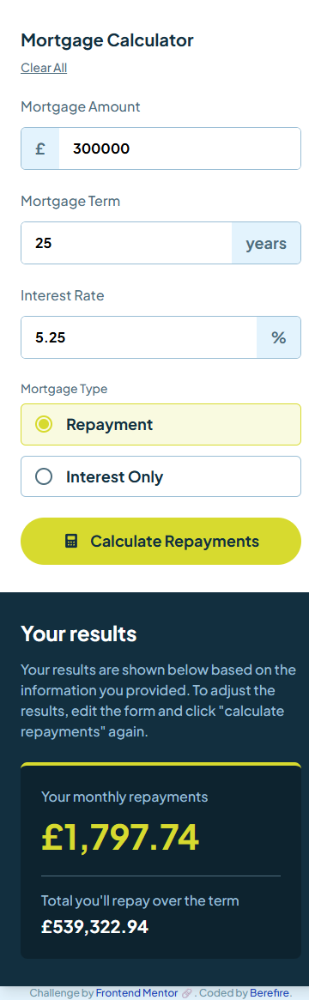
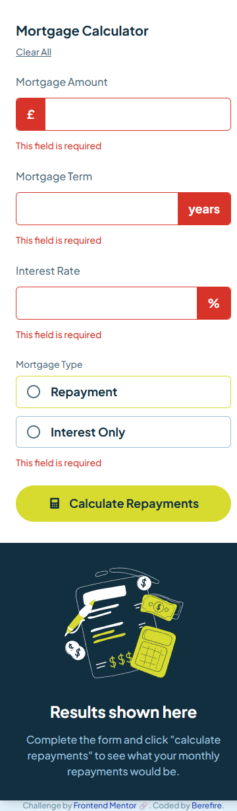
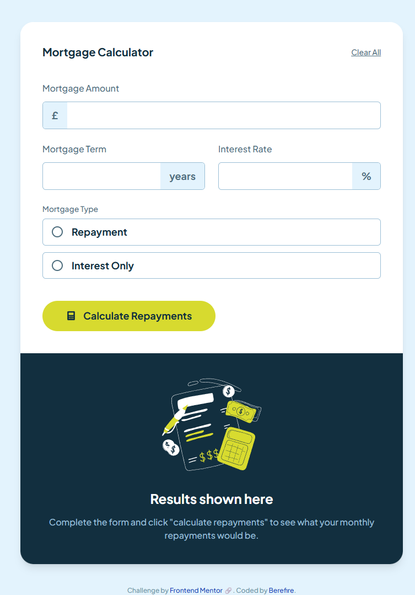
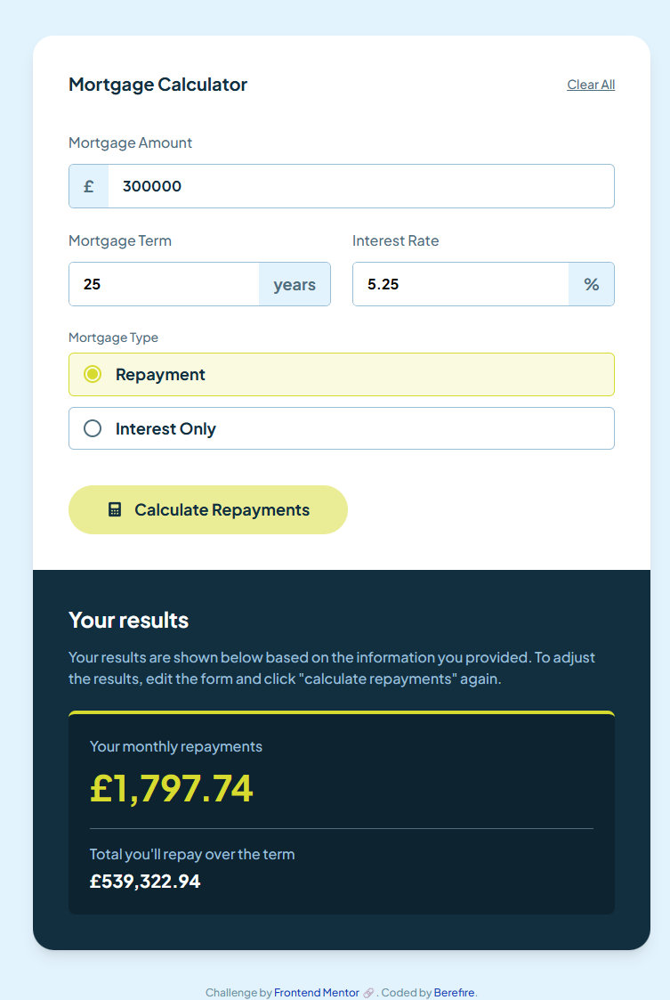
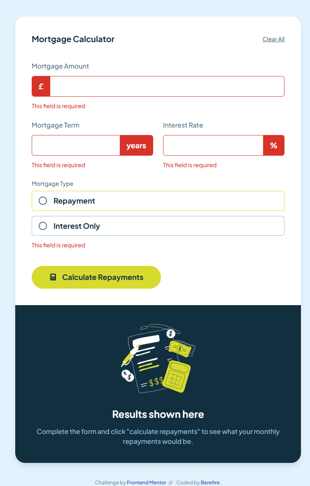
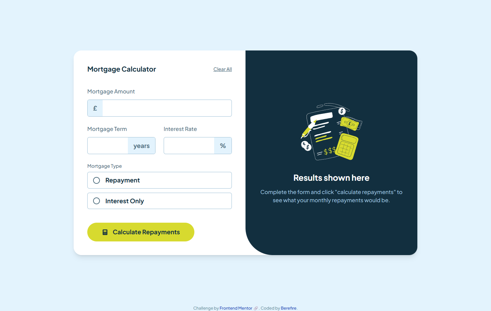
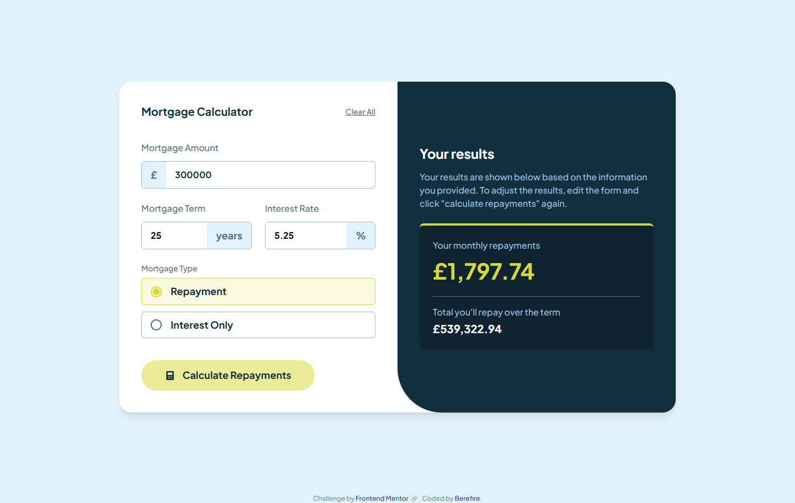
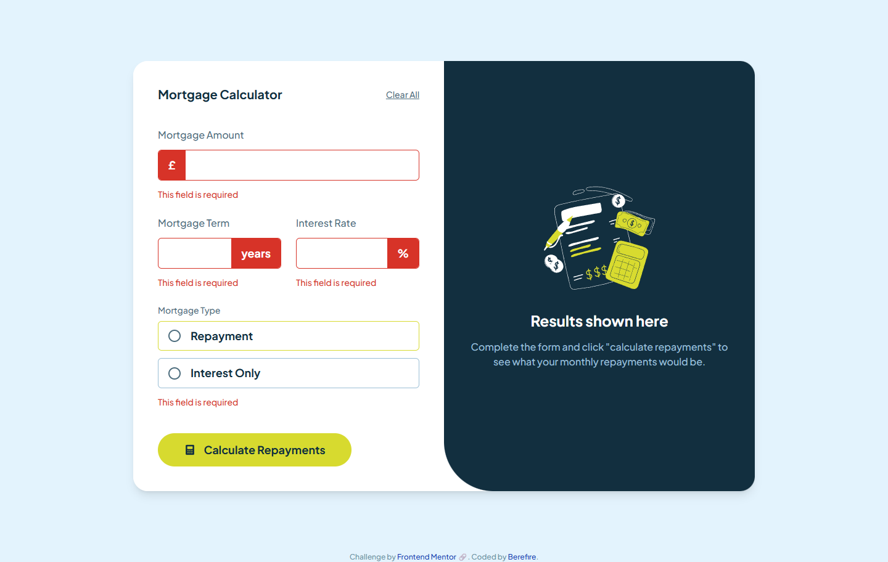

# Frontend Mentor - Mortgage repayment calculator solution


[](https://www.frontendmentor.io/)


This is a solution to the [Mortgage repayment calculator challenge on Frontend Mentor](https://www.frontendmentor.io/challenges/mortgage-repayment-calculator-Galx1LXK73). Frontend Mentor challenges help you improve your coding skills by building realistic projects.

---

## Table of contents

- [Overview](#overview)
  - [The challenge](#the-challenge)
  - [Screenshot](#screenshot)
  - [Links](#links)
- [My process](#️my-process)
  - [Built with](#built-with)
  - [What I learned](#what-i-learned)
  - [Continued development](#continued-development)
  - [Useful resources](#useful-resources)
  - [AI Collaboration](#ai-collaboration)
- [Author](#author)
- [Acknowledgments](#acknowledgments)

---

## 📖Overview

### The challenge

Users should be able to:

- Input mortgage information and see monthly repayment and total repayment amounts after submitting the form
- See form validation messages if any field is incomplete
- Complete the form only using their keyboard
- View the optimal layout for the interface depending on their device's screen size
- See hover and focus states for all interactive elements on the page

### 📸Screenshot

#### Mobile

| _Empty state_ | _Results_ | _Validation errors_ |
| ------ | ------ | -------- |
|  |  |  |

#### Tablet

| _Empty state_ | _Results_ | _Validation errors_ |
| ------ | ------ | -------- |
|  |  |  |

#### Desktop

| _Empty state_ | _Results_ | _Validation errors_ |
| ------ | ------ | -------- |
|  |  |  |

---

### 🔗Links

- Solution URL: [https://www.frontendmentor.io/solutions/mortgage-repayment-calculator-built-with-react-and-tailwind-css-v4-OKSebcSEJk](https://www.frontendmentor.io/solutions/mortgage-repayment-calculator-built-with-react-and-tailwind-css-v4-OKSebcSEJk)
- Live Site URL: [https://berefire.github.io/mortgage-repayment-calculator/](https://berefire.github.io/mortgage-repayment-calculator/)

---

## ⚙️My process

### Built with

- [React](https://react.dev/) - JS library for building the UI as small, composable components
- [Vite](https://vitejs.dev/) - build tool and dev server
- [Tailwind CSS v4](https://tailwindcss.com/) - utility-first styling via the `@tailwindcss/vite` plugin
- [Storybook](https://storybook.js.org/) - for developing and documenting components in isolation, with `addon-a11y` and Vitest browser-mode interaction tests
- Semantic form elements - `<fieldset>`/`<legend>` for the mortgage type radio group, `<label htmlFor>` paired with every input
- `aria-live`/`aria-atomic` on the results panel, so a screen reader announces new results without the user needing to navigate to them manually
- `Intl.NumberFormat` for locale-aware currency formatting
- Mobile-first responsive workflow
- Conventional Commits for commit message structure

---

### 💡What I learned

**A sibling element can't react to another sibling's focus with plain CSS - Tailwind's `group` pattern solves this.** The currency symbol box next to each input needed to change background color when the input itself was focused, but `focus-within` only works on an actual ancestor of the focused element - the symbol `<span>` is a sibling of the `<input>`, not a parent of it. Marking the wrapper `group` and using `group-focus-within:` on the symbol fixed it:

```jsx
<div className="group flex items-stretch rounded-md border focus-within:border-lime">
  <span className="bg-slate-100 group-focus-within:bg-lime-light">£</span>
  <input className="flex-1 min-w-0" />
</div>
```

**Flexbox's default `min-width: auto` caused a layout overflow at the `lg` breakpoint - a second time, in a different project.** The Mortgage Term and Interest Rate inputs sat side-by-side in a `flex md:flex-row` row, and at larger viewports the row overflowed into the results panel instead of shrinking to fit. The `<input>` itself already had `min-w-0`, but the actual flex item competing for space in that row was `FormInput`'s outer wrapper `div`, several levels up - and **that** element didn't have it:

```jsx
// the flex item that needed min-w-0 wasn't the <input> - it was this wrapper
<div className="flex flex-1 min-w-0 flex-col gap-3 items-start">
```

**A component folder named after its component breaks Vite's `@` alias shorthand.** With a `src/components/RadioOption/RadioOption.jsx` structure, importing `@/components/RadioOption` resolves to the **folder**, and Vite only auto-resolves a folder import to `index.js` - not to a same-named file inside it. Adding a one-line `index.js` barrel (`export { default } from './RadioOption';`) to every component folder fixed this permanently, rather than patching each import path individually.

**Chrome's autofill background color can't be overridden with normal `background-color` CSS.** An input that the browser had autofilled kept a pale blue background no matter what Tailwind class was applied. The fix is a well-known workaround using an oversized inset `box-shadow` to visually cover the browser's own styling, since `background-color` itself is blocked on `:-webkit-autofill`:

```css
input:-webkit-autofill {
  -webkit-box-shadow: 0 0 0rem 62.5rem white inset;
  -webkit-text-fill-color: currentColor;
}
```

**Nothing should reach the calculation function until the form is actually valid.** Submitting an empty form used to produce `NaN` in the results panel, because `calculateMortgage` was being called with empty/invalid values (e.g. dividing by zero payments). Validating on submit and only calling `onCalculate` when there are no errors fixed it at the source, rather than trying to make the calculation function defensive against bad input.

---

### 🚀Continued development

- Decide whether the interest-only "total repayment" figure should include repaying the original principal at the end of the term, or only the interest paid during it - currently it's interest-only, which may not match every interpretation of the brief
- Verify keyboard-only completion of the form and confirm inputs auto-select their content on focus, per the original brief
- Run an automated accessibility audit beyond the manual `addon-a11y` checks

---

### 📚Useful resources

- [Storybook - Interaction testing](https://storybook.js.org/docs/writing-tests/interaction-testing) - Confirmed how `canvas`/`userEvent`/`expect` are provided to the `play` function in current Storybook versions.
- [Testing Library - Role queries](https://testing-library.com/docs/queries/byrole/) - Clarified that `role="presentation"`/`"none"` elements are always included in `getByRole` queries, regardless of the `hidden` option.
- [MDN - :autofill CSS pseudo-class](https://developer.mozilla.org/en-US/docs/Web/CSS/:autofill) / [Tailwind autofill discussion](https://github.com/tailwindlabs/tailwindcss/discussions/8679) - Explained why normal background overrides don't work on autofilled inputs, and the `box-shadow` workaround.
- [Vite - JSX in .js files discussion](https://github.com/vitejs/vite/discussions/14652) - Confirmed Vite doesn't parse JSX in plain `.js` files by default, only `.jsx`/`.tsx`.
- [Vite - Builder aliases GitHub issue](https://github.com/tailwindlabs/tailwindcss/discussions/9621) - Background on why Storybook's Vite builder sometimes needs its alias config re-declared explicitly.

---

### 🤖AI Collaboration

I used Claude throughout this project as an assistant rather than having it write the project for me: I wrote and applied the code myself, and Claude explained concepts, reviewed what I wrote, and provided code to look at and adapt when I asked for it directly.

- **What worked well:** pasting the actual, complete error output (not just a summary) made a real difference - several Vite/Storybook alias resolution issues took multiple rounds to diagnose specifically because early error pastes were cut off before the actual error message. Once the full error and file tree were shared, the fix was usually quick. Having Claude verify current library behavior (Storybook 9's `storybook/test` package rename, Vite's JSX-in-`.js` limitation, Testing Library's role-query behavior) against real documentation instead of relying on memory also avoided a few wrong guesses.
- **What didn't work as well at first:** the `@` path alias issue took several back-and-forth attempts before landing on the real cause - it turned out to be three separate things (a missing `index.js` barrel per component folder, a missing `viteFinal` in `.storybook/main.js`, and a missing alias in the `test.projects` block) rather than one single fix, which made early attempts look like they should have worked but didn't.

---

## 👤Author

- Frontend Mentor - [@berefire](https://www.frontendmentor.io/profile/berefire)
- GitHub - [@berefire](https://github.com/berefire)

---

## 🙏Acknowledgments

Thanks to Frontend Mentor for the challenge design files and starter assets, and to Claude for the pair-programming support and code reviews.

---
